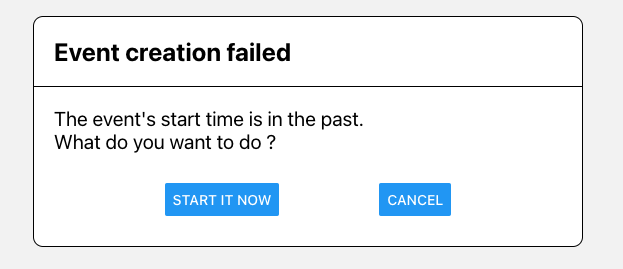

# Event creation

## Default durations

When creating an event as an organizer of a LAO, you have 3 choices: meeting, roll call and election.
The start time is the current time by default. Each one of them has a default duration that can be modified.
When setting the start time of the corresponding event, the end time is set automatically according to
this duration. Organizers can easily change the end time if they want to.

## Creating events in the past

If the event creation page remains open without any modification, it can cause issues when submitting the
event. If the ending time is now in the past, a modal will appear, informing that an event cannot end in
the past. If the start time differs of more than 5 minutes with the current time, another modal will appear,
asking if the user is willing to start it now.

Here are the modals in fe1-web:

<<<<<<< HEAD

=======

>>>>>>> c715fc2739620887902a9819d7880636d994e363

## Start time, end time and creation time

The back-ends do not accept any events that start before their creation time or end before their start
time. Then, before sending the message to the network, the front-end checks that the times are correct
and adapt them if needed.
